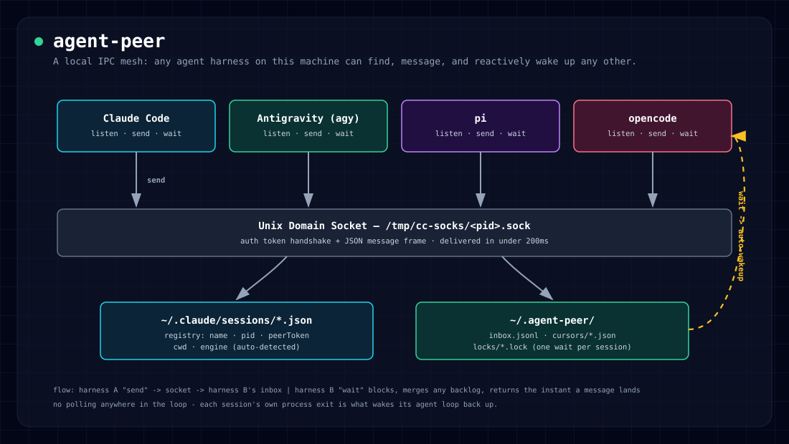

<p align="center">
  
</p>

<p align="center">
  <a href="#install"><strong>Install</strong></a> &middot;
  <a href="#usage"><strong>Usage</strong></a> &middot;
  <a href="./skills"><strong>Skills</strong></a> &middot;
  <a href="./docs"><strong>Docs</strong></a> &middot;
  <a href="./docs/status.md"><strong>Status</strong></a> &middot;
  <a href="#license"><strong>License</strong></a>
</p>

<p align="center">
  <a href="./LICENSE"></a>
  
  
</p>

# agent-peer

A local IPC mesh so any agent harness on your machine — Claude Code,
Antigravity, `pi`, `opencode`, Codex CLI, or your own script — can find,
message, and reactively wake up any other. No polling, no per-harness glue
code.

No harness is the hub here. Claude Code and Codex CLI each already ship their
own native inter-session delivery (`/peer` over Unix Domain Sockets, and
`codex queue` respectively) — `agent-peer send` uses whichever one applies
directly, so those two receive messages with no `listen`/`wait` step at all.
Antigravity, `pi`, and opencode have no native equivalent, so `agent-peer`
gives them a shared Unix Domain Socket transport plus a blocking `wait` that
plays the same role. Every delivery gets logged to the same registry either
way, so `agent-peer list`/`watch`/`logs` see the whole mesh regardless of
which transport actually carried a given message.

## Highlights

- **Sub-200ms delivery**, no polling anywhere in the loop.
- **Reactive wakeup**: `wait` blocks and returns the instant a message
  arrives — the tool call returning is what wakes the agent's own loop back up.
- **Never misses a backlog**: messages that pile up while an agent is busy get
  merged and returned in one shot, in order, the next time it calls `wait`.
- **Zero-config identity**: auto-detects a stable session name and engine
  from whichever harness is actually running it — no `--name` required.
- **Zero heavy dependencies** — pure Python 3.10+, standard library only.

## Install

```bash
uv tool install agent-peer
```

No `uv`? `pipx install agent-peer` or `python3 -m pip install --user agent-peer`
work the same way. All three put a global `agent-peer` command on your PATH.

**Contributing or tracking `main` instead of a release?**
```bash
git clone https://github.com/mkhuda/agent-peer.git
cd agent-peer
uv tool install --editable . --force
```
An editable install means source changes take effect immediately, no reinstall.

## Usage

**Discover who's reachable:**
```bash
agent-peer list
```
```text
PID      SESSION NAME    ENGINE   STATUS   ALIVE  SOCKET        CWD
------------------------------------------------------------------------
41213    my-app-fe       Claude   idle     yes    41213.sock    ~/projects/my-app
52901    agy-33402       AGY      idle     yes    52901.sock    ~/projects/my-app
```

**Send a message**, by name or PID:
```bash
agent-peer send my-app-fe "review the auth middleware diff when you're free"
agent-peer send agy-33402 "[stop] hold off on that migration, see docs/" --priority now
```

**Become reachable**, from any harness:
```bash
agent-peer listen
```
`--name` is optional everywhere (`listen`, `send --sender`, and the session
filter on `wait`). Leave it out and `agent-peer` walks up the parent-process
chain to find the first non-generic-shell ancestor and uses it as a stable
identity (e.g. `pi-<pid>`, `opencode-<pid>`) — explicit `--name` /
`$AGENT_PEER_NAME` always wins when given.

**React without polling:**
```bash
agent-peer wait --timeout 30
```
The call blocks and returns the moment there's something to read. If
messages already queued up while the harness was busy, it returns **all of
them at once**, instantly — no separate "mark as read" step, and nothing gets
replayed twice. Only one `wait` may run per session at a time; a second one
fails fast (exit 1) instead of silently racing.

**Inspect the inbox:**
```bash
agent-peer inbox            # recent messages
agent-peer inbox --clear    # wipe it (also resets the read cursor)
```

**Watch the mesh live:**
```bash
agent-peer watch             # tail everything, formatted
agent-peer watch -s my-app-fe   # just one session
```

**Clean up dead registrations:**
```bash
agent-peer prune
```
A listener killed with `SIGKILL` (not a graceful `Ctrl+C`) never gets the
chance to clean up after itself, leaving a registration behind that shows
`ALIVE: no` in `list` forever. `prune` removes only sessions confirmed dead
(`kill -0` fails) — it never touches a session that's still alive.

## Teaching a harness about `agent-peer`

[`skills/`](./skills) ships a ready `SKILL.md` per harness (agy, pi, opencode,
Codex CLI) plus a README explaining exactly where and how to install it —
each harness turned out to have a genuinely different convention for skill
location, frontmatter, and trigger mechanism, verified against its own
source/docs rather than assumed.

## Architecture

**Antigravity, `pi`, and opencode** go through agent-peer's own Unix Domain
Socket transport, which mirrors the handshake Claude Code enforces for its
native sessions:

1. **PID validation** — the target process must actually be running.
2. **Start-time verification** — matches `ps -o lstart=` against the
   registered process, so a reused PID can't impersonate an old session.
3. **Auth handshake** — first frame must be `{"type":"auth","token":"<peerToken>"}`.
4. **Message frame** — `{"type":"user","priority":"now","from":"...","message":{"content":"..."}}`.

`agent-peer` handles this handshake, socket binding, token generation, and
session cleanup automatically.

**Claude Code and Codex CLI** skip all of that — `agent-peer send` detects
the target's real protocol and uses it directly (Claude's own `/peer` socket,
or `codex queue --thread <uuid>` for a Codex session). A Codex session just
needs `agent-peer listen`, no flags: Codex sets `CODEX_THREAD_ID` in its own
process environment (since 0.154.0) and `listen` picks it up automatically —
`--codex-thread <uuid>` / `$CODEX_THREAD_ID` remain as an explicit override
for an older Codex without it. Either way the delivery is still recorded to
`~/.agent-peer/inbox.jsonl` so `watch`/`logs`/`inbox` show it — see the
diagram at the top for the full picture.

## Docs

- [`docs/status.md`](./docs/status.md) — how `agent-peer status` sources agy
  and Claude Code quota/context numbers.
- [`docs/`](./docs) — design notes, known limitations, and past investigation
  reports written while building this.
- [`skills/`](./skills) — per-harness `SKILL.md` templates and install guides.

## License

[MIT](./LICENSE).
